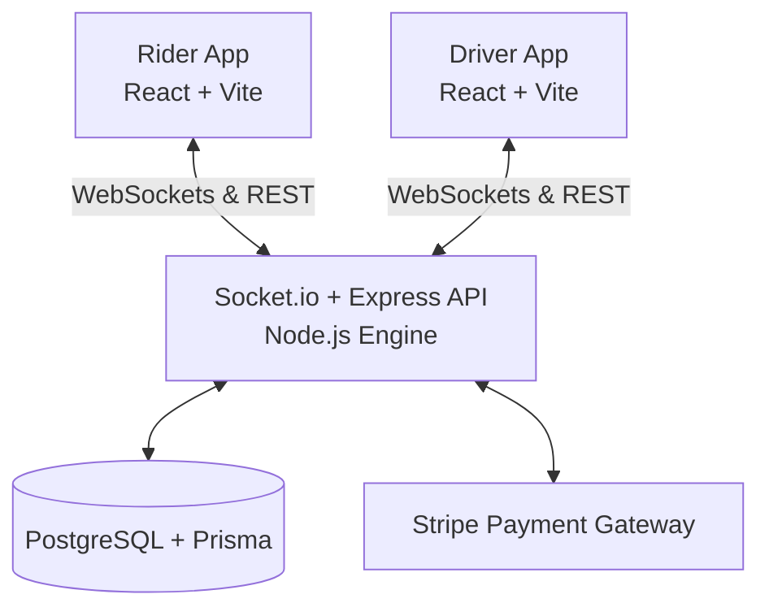

<div align="center">
  
  <h1>RideShare Platform</h1>
  <p><strong>A production-ready, real-time ride-hailing monorepo architecture.</strong></p>

  <a href="https://react.dev/"></a>
  <a href="https://nodejs.org/"></a>
  <a href="https://socket.io/"></a>
  <a href="https://www.prisma.io/"></a>
  <a href="https://stripe.com/"></a>
  <a href="https://www.typescriptlang.org/"></a>
</div>

<br />

The RideShare Platform is a comprehensive, full-stack monorepo demonstrating modern web architecture patterns. It facilitates real-time ride booking, GPS tracking, and secure financial transactions through concurrent Rider and Driver applications powered by a Node.js/Socket.io backend.

---

## ⚡ Core Capabilities

- **Real-Time Event Streaming**: Sub-second GPS synchronization and state-machine transitions powered by Socket.io.
- **Privacy-First WebSockets**: Drivers broadcast raw GPS coordinates exclusively to their assigned `trip:{id}` room, preventing location leaks.
- **Atomic Concurrency**: Prisma `updateMany` constraints prevent double-booking race conditions when multiple drivers attempt to accept the same trip simultaneously.
- **PCI-Compliant Payments**: Stripe Elements handles card collection, using an authorize-and-capture flow that only charges the rider upon successful trip completion.
- **Interactive Mapping**: React-Leaflet integration with OpenStreetMap tiles, dynamic center point tracking, and custom localized markers.

---

## 🛠️ Monorepo Architecture

This project strictly adheres to a domain-driven monorepo structure, ensuring type-safety boundaries and synchronized deployments.



### 1. `server/` (Backend Engine)
- **Framework**: Express.js + Node.js
- **Database**: PostgreSQL with Prisma ORM
- **Authentication**: Stateless JWT via HTTP headers
- **Real-time**: Socket.io middleware validating JWTs on handshake

### 2. `rider-app/` (Consumer Client)
- **Framework**: React 18 + Vite
- **UI Architecture**: Glassmorphism CSS Modules, protected routing via React Router DOM
- **Key Hooks**: `useSocket` (persistent connection), `useTrip` (client-side state machine tracking idle -> matched -> completed)

### 3. `driver-app/` (Provider Client)
- **Framework**: React 18 + Vite
- **Tracking**: `useLocation` hook utilizing `navigator.geolocation.watchPosition` with throttled 2-second socket emissions.
- **Experience**: 15-second auto-dismissing trip request overlays, earnings dashboard, and online/offline availability toggles.

---

## 🚀 Local Development Setup

### Prerequisites
- Node.js (v18+ LTS)
- PostgreSQL (v14+)
- Stripe Test Account keys

### 1. Installation
Clone the repository and install the monorepo dependencies:
```bash
npm install
```

### 2. Environment Configuration
Create `.env` files based on the provided examples.
- `server/.env`: Requires `DATABASE_URL`, `JWT_SECRET`, `STRIPE_SECRET_KEY`
- `rider-app/.env`: Requires `VITE_API_URL`, `VITE_SOCKET_URL`, `VITE_STRIPE_PUBLISHABLE_KEY`
- `driver-app/.env`: Requires `VITE_API_URL`, `VITE_SOCKET_URL`

### 3. Database Initialization
```bash
cd server
npx prisma migrate dev --name init
npx prisma generate
```

### 4. Bootstrapping
Launch the entire stack concurrently from the root directory:
```bash
npm start
```
The services will be available at:
- **API Server**: `http://localhost:3001`
- **Rider Client**: `http://localhost:5173`
- **Driver Client**: `http://localhost:5174`

---

## 📖 Iteration History

1. **Phase 1: Scaffolding & Auth**: Monorepo structure, Express + React Vite setups, JWT + bcrypt authentication.
2. **Phase 2: Data Modeling**: Prisma schema implementation (User, Trip, DriverLocation), REST endpoints, and Haversine distance-based driver matching algorithms.
3. **Phase 3: Real-Time Logistics**: Socket.io integration, driver tracking hooks, atomic database updates, Leaflet map implementation.
4. **Phase 4: Financial Security**: Stripe authorization-capture pipeline, webhook signature verification, React Stripe Elements integration.

---
<div align="center">
  <i>Engineered for scale, speed, and real-time reliability.</i>
</div>
