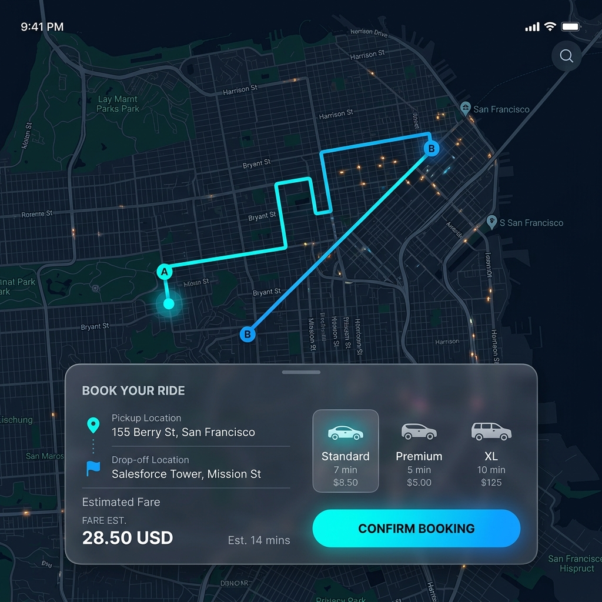
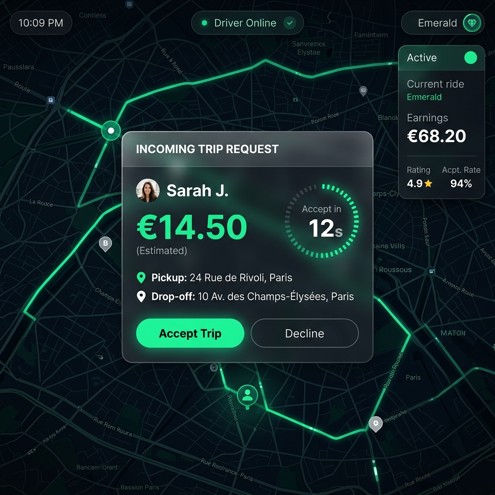

# RideShare Platform

A production-grade, real-time ride-hailing platform built with a modern TypeScript monorepo architecture. The platform supports concurrent rider and driver applications connected via a robust Socket.io real-time engine, with integrated Stripe payment processing and secure role-based access control.

## System Overview

The RideShare platform is divided into three core subsystems operating in a monorepo structure:
- **Server**: A high-performance Node.js/Express API with PostgreSQL (Prisma ORM) and a real-time Socket.io layer.
- **Rider Application**: A React/Vite front-end enabling users to book rides, track drivers on a live map, and authorize payments securely.
- **Driver Application**: A React/Vite front-end providing drivers with real-time trip requests, live GPS broadcasting, and an earnings dashboard.

## Application Interfaces

<div align="center">
  
  
</div>

## Architecture and Technical Stack

**Backend infrastructure**
- Node.js and Express.js REST API
- WebSockets via Socket.io for real-time bidirectional event streaming
- PostgreSQL Database using Prisma ORM
- JSON Web Token (JWT) based authentication and authorization
- Stripe API for payment intent creation and manual capture flow

**Frontend Infrastructure**
- React 18 with Vite for rapid bundling
- TypeScript for end-to-end type safety
- React Router DOM for client-side navigation
- React-Leaflet with OpenStreetMap for interactive, high-performance mapping
- CSS Modules for localized, collision-free styling
- Stripe Elements for PCI-compliant payment data collection

**Design Patterns**
- **Monorepo**: Centralized codebase for synchronized backend/frontend updates.
- **Event-Driven State Machines**: Complex trip lifecycles (Idle -> Requesting -> Matched -> Started -> Completed) managed robustly across the network.
- **Room-based Broadcasting**: Socket.io rooms used to enforce data privacy, ensuring drivers only broadcast precise coordinates to their assigned rider.

## Project Setup and Local Development

### Prerequisites
- Node.js (v18+ recommended)
- PostgreSQL (v14+ recommended)
- Stripe Account (for test API keys)

### Installation

1. Clone the repository and install dependencies from the root:
   ```bash
   npm install
   ```

2. Environment Configuration:
   Configure the `.env` variables in `server/`, `rider-app/`, and `driver-app/`.
   Required variables include `DATABASE_URL`, `JWT_SECRET`, and Stripe keys.

3. Database Initialization:
   ```bash
   cd server
   npx prisma migrate dev --name init
   npx prisma generate
   ```

4. Start the Development Servers:
   From the project root, launch the concurrent services:
   ```bash
   npm start
   ```
   - Server running on `http://localhost:3001`
   - Rider App running on `http://localhost:5173`
   - Driver App running on `http://localhost:5174`

## Implementation Details

The system was built iteratively, adhering to strict software engineering standards.

### Phase 1: Authentication and Scaffolding
Established the monorepo foundation. Configured the Express backend and React frontends. Implemented secure user registration and login workflows utilizing bcrypt for password hashing and JWT for stateless authentication.

### Phase 2: Core Trip Logistics and Database Design
Extended the PostgreSQL schema via Prisma to handle complex relational data including Users, Trips, and real-time Driver Locations. Developed the REST API layer for CRUD operations on trips and integrated a Haversine formula-based matching algorithm to locate proximal available drivers efficiently.

### Phase 3: Real-Time Event Streaming
Integrated Socket.io to handle low-latency interactions. Engineered custom event handlers for continuous GPS polling from drivers, trip request broadcasting, and atomic trip acceptance to prevent race conditions (double-matching). Implemented dynamic Leaflet maps on the front-end to visualize real-time coordinate updates.

### Phase 4: Financial Transactions and Security
Integrated Stripe for secure payment processing. Utilized the authorize-and-capture paradigm: placing a hold on the rider's card upon booking confirmation and capturing the funds programmatically via the backend only when the driver completes the trip. Built custom, stylized Stripe Elements forms in the React client to maintain a seamless user experience while ensuring PCI compliance.
