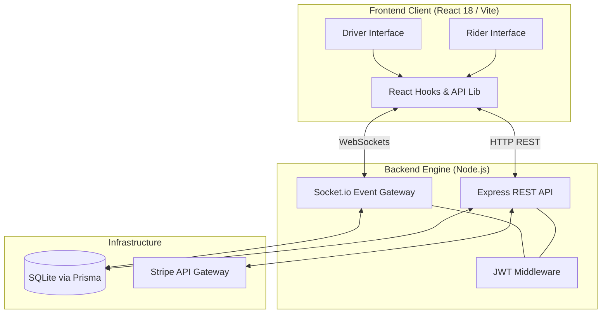

<div align="center">
  
  <h1>RideShare Platform architecture</h1>
  <p><strong>An event-driven, real-time logistics and ride-hailing monorepo.</strong></p>

  <p>
    <a href="https://react.dev/"></a>
    <a href="https://nodejs.org/"></a>
    <a href="https://socket.io/"></a>
    <a href="https://www.prisma.io/"></a>
    <a href="https://stripe.com/"></a>
    <a href="https://www.typescriptlang.org/"></a>
  </p>
</div>

---

## 🚀 Engineering Overview

RideShare isn't just a clone; it is a **production-ready architectural blueprint** for two-sided real-time marketplaces. Built as a strict monorepo, it elegantly solves complex logistics problems—such as double-booking race conditions, real-time geographical tracking, and secure two-phase financial transactions—all while serving a unified frontend experience to both Riders and Drivers.

### 🔥 Hard Problems Solved

- **Distributed Race Conditions:** When multiple drivers attempt to accept the same ride broadcast simultaneously, the backend utilizes Prisma's `updateMany` constraints to guarantee an atomic lock, ensuring only one driver is assigned the trip.
- **State Machine Synchronization:** Trips follow a strict lifecycle (`IDLE` → `REQUESTING` → `MATCHED` → `STARTED` → `COMPLETED`). State is synchronized across the backend database and React clients in sub-millisecond latency using Socket.io namespaces and rooms.
- **Privacy-Preserving Geofencing:** Driver locations are broadcasted via `navigator.geolocation.watchPosition` with a throttled 2-second heartbeat, emitted exclusively to assigned socket rooms to prevent location leaking.
- **PCI-Compliant Two-Phase Commits:** Uses Stripe's Authorize-and-Capture flow. The rider's card is authorized during the booking phase but only captured upon the `trip:completed` webhook, preventing orphaned charges if a ride is cancelled.

---

## 🏗 System Architecture

The entire platform runs as a **Monorepo**. Instead of maintaining separate apps for riders and drivers, a single React SPA handles both experiences using Role-Based Access Control (RBAC) and dynamic routing.


```mermaid
graph TD
    subgraph "Frontend Client (React 18 / Vite)"
        RiderUI[Rider Interface]
        DriverUI[Driver Interface]
        State[React Hooks & API Lib]
        RiderUI --> State
        DriverUI --> State
    end

    subgraph "Backend Engine (Node.js)"
        API[Express REST API]
        Sockets[Socket.io Event Gateway]
        Auth[JWT Middleware]
        API --- Auth
        Sockets --- Auth
    end

    subgraph "Infrastructure"
        DB[(SQLite via Prisma)]
        Stripe[Stripe API Gateway]
    end

    State <-->|HTTP REST| API
    State <-->|WebSockets| Sockets
    
    API <--> DB
    Sockets <--> DB
    API <--> Stripe
```

---

## 💻 Tech Stack Deep Dive

### Frontend (`/rider-app`)
- **Core:** React 18, Vite, TypeScript.
- **Styling:** Custom CSS Modules featuring a dynamic light/dark mode CSS Variable architecture and premium glassmorphism aesthetics.
- **Mapping:** `react-leaflet` with custom tile filters and hardware-accelerated marker rendering.
- **State & Real-time:** Custom hooks (`useSocket`, `useTrip`, `useDriverLocation`) for decoupling UI from WebSocket business logic.

### Backend (`/server`)
- **Core:** Node.js, Express.js, TypeScript.
- **Real-Time:** Socket.io with JWT handshake validation.
- **Data Layer:** Prisma ORM over SQLite (easily swappable to PostgreSQL).
- **Security:** bcrypt password hashing (12 rounds), stateless JWT session tokens, and Stripe Signature webhook validation.

---

## 🚦 Quick Start Guide

We've built a custom Python launcher to get the entire distributed system running locally with a single command.

### Prerequisites
1. **Node.js** (v18 or higher)
2. **Python** (v3.8 or higher)

### Bootstrapping the Platform

Simply clone the repository and run the automated launcher:

```bash
git clone https://github.com/sarthaksaxenaa/RideShare-Platform.git
cd RideShare-Platform
python run.py
```

**What the launcher does automatically:**
1. Installs all NPM dependencies across the monorepo workspaces.
2. Auto-generates the `server/.env` file with secure development defaults.
3. Generates the Prisma Client and pushes the SQLite schema (`dev.db`).
4. Boots up the Express/Socket API and Vite Dev Server concurrently.

**Access Points:**
- 🌐 **Web Client:** [http://localhost:5173](http://localhost:5173) (Login as Rider or Driver)
- 🔌 **API Server:** [http://localhost:3001](http://localhost:3001)
- 🩺 **Health Check:** [http://localhost:3001/health](http://localhost:3001/health)

---

## 📖 API & Event Dictionary

### RESTful Endpoints

| Method | Path | Auth Required | Description |
|--------|------|---------------|-------------|
| `POST` | `/api/auth/register` | No | Creates a new user (Rider/Driver) and returns a JWT. |
| `POST` | `/api/auth/login` | No | Authenticates credentials and returns a JWT. |
| `GET`  | `/api/trips/estimate`| Yes | Calculates Haversine distance and returns dynamic fare estimates. |
| `POST` | `/api/trips/book`    | Yes | Creates Trip record + Stripe PaymentIntent (if configured). |
| `GET`  | `/api/trips/:id`     | Yes | Fetches immutable state of a specific trip. |
| `GET`  | `/api/users/me`      | Yes | Returns current authenticated user profile. |

### WebSocket Event Matrix

| Event Name | Direction | Payload Context |
|------------|-----------|-----------------|
| `trip:request` | Client → Server | Rider initiates global broadcast for a matched vehicle tier. |
| `trip:matched` | Server → Client | System notifies Rider that a Driver has locked the trip. |
| `trip:accept` | Client → Server | Driver attempts to acquire a lock on a pending trip request. |
| `trip:start` | Client → Server | Driver signals physical pickup; state transitions to `STARTED`. |
| `trip:complete`| Client → Server | Driver signals drop-off; triggers Stripe capture workflow. |
| `driver:location` | Bidirectional | Live coordinate streaming (lat/lng) scoped to active trips. |

---

## 🔒 Configuration & Mocking

The system is engineered to degrade gracefully for local development. By default, `run.py` configures the backend **without Stripe keys**. 

When Stripe keys are absent, the application automatically enables **Mock Payment Mode**:
- `PaymentIntent` generation is bypassed on the server.
- The React client intercepts the mock tokens (`pi_mock_secret_...`) and skips the Stripe Elements UI.
- Developers can test the entire end-to-end booking, matching, and completion flow without external network dependencies.

To enable real payments, update `server/.env`:
```env
STRIPE_SECRET_KEY=sk_test_...
STRIPE_WEBHOOK_SECRET=whsec_...
```

---

<div align="center">
  <i>Architected for scale, engineered for reliability, designed for speed.</i>
</div>
